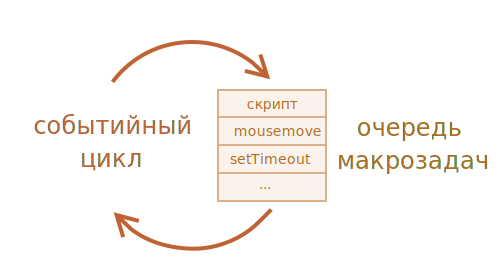

## Как работает Event loop
1. Когда интерпретатор доходит до асинхронного кода, например `setTimeout`, то закидывает команду с асинхронным кодом в `стек`
2. Далее эта команда из стеку выкидывается и регистрируется функция-обработчик, переданная в `setTimeout`
3. После того, как браузерный сторонний API выполнит метод `setTimeout` функция, переданная в `setTimeout`, попадает в `очередь`.
4. В этой очереди работает обычный цикл (`Event loop`), который пробегается по этой очереди, и если видит, что функция готова, то он закидывает её обратно в стек и там она вызывается.
5. Таким образом мы не блокируем поток и можем использовать асинхронность.

**Сервис**, демонстрирующий порядок организации работы Event loop: [latentflip.com](http://latentflip.com/loupe/?code=JC5vbignYnV0dG9uJywgJ2NsaWNrJywgZnVuY3Rpb24gb25DbGljaygpIHsKICAgIHNldFRpbWVvdXQoZnVuY3Rpb24gdGltZXIoKSB7CiAgICAgICAgY29uc29sZS5sb2coJ1lvdSBjbGlja2VkIHRoZSBidXR0b24hJyk7ICAgIAogICAgfSwgMjAwMCk7Cn0pOwoKY29uc29sZS5sb2coIkhpISIpOwoKc2V0VGltZW91dChmdW5jdGlvbiB0aW1lb3V0KCkgewogICAgY29uc29sZS5sb2coIkNsaWNrIHRoZSBidXR0b24hIik7Cn0sIDUwMDApOwoKY29uc29sZS5sb2coIldlbGNvbWUgdG8gbG91cGUuIik7!!!PGJ1dHRvbj5DbGljayBtZSE8L2J1dHRvbj4%3D)

## Концепт `setTimeout 0`
    console.log('start)

    setTimeout(function() {

        console.log('Inside timeout')}, 0)

    console.log('end)
Здесь, несмотря на то, что задержка в `setTimeout` задана значение `0`, функция, переданная в `setTimeout` всё равно вызовется только по окончании всех синхронных команд, так как она попадет в очередь и будет ждать их окончания там. То есть порядок вывода логирования будет следующий:
1. start
2. end
3. Inside timeout

[Событийный цикл: микрозадачи и макрозадачи](https://learn.javascript.ru/event-loop#makrozadachi-i-mikrozadachi)

[Микрозадачи](https://learn.javascript.ru/microtask-queue)

[Видео разбор](https://www.youtube.com/watch?v=vIZs5tH-HGQ)