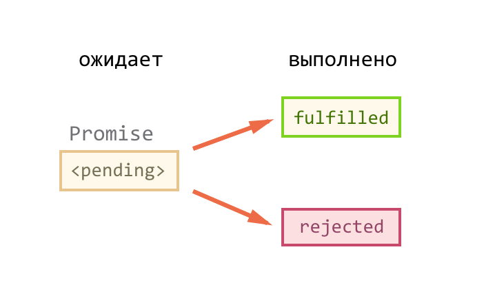

# Promises
## 1. Что такое promise, then, catch - основы

**`Promise`** - объект (обещание), который может находиться в одном из 3-х состояний: `pending`(ожидание), `resolved/fulfilled`(выполнен успешно), `rejected`(выполнен с ошибкой). При этом, если промис перешел в состояние `resolved` или `rejected`, то изменить его он уже не сможет. 

Объект `promise`, как правило, возвращает какая-то функция вместо конкретных данных, ввуду того, что функция не может вернуть эти данные здесь и сейчас (запрос на сервер, в базу данных и т.п. выполняются асинхронно).

### Интерфейс объекта `promise`:
 1. Свойств нет;
 2.  **Метод `then`** - для подписки на событие `resolve` промиса (когда `promise` будет за-`resolve`-лен). В `then` передается коллбэк. Этот коллбэк выполняется, когда `promise` за-`resolve`-тся. Как правило, в этот коллбэк приходят данные, которые функция обещает достать.
 3.  **Метод `catch`** - для подписки на событие `reject` промиса (`promise` никогда не выполнится). Когда `promise` `reject`-тся, это воспринимается браузером как ошибка, но эта ошибка в отличие от остальных не ломает всё приложения. Т.е. в `then` при таком раскладе мы никогда не попадем. В `catch` также, как и в `then` передается коллбэк, в который, как правило, приходит какая-то ошибка. Как правило, для одного промиса используется и `then` и `catch` в виде последовательной цепочки, чтобы предусматреть все ситуации. 
 4. **Метод `finally`** - метод, в котором выполняется функционал, независимо от того, promise за-`resolve`-лся или за-`reject`-ился. В `finally` также передается коллбэк, но в этот коллбэк уже не приходят никакие данные. Это просто кусок кода, который выполняется, когда `promise` за-`resolve`-ился или за-`reject`-ился.
 
 ## 2. Схематично про state\status промиса: pending\fullfilled\rejected

**Promise** (обычно их так и называют «промисы») – предоставляют удобный способ организации асинхронного кода.

На promise можно навешивать колбэки двух типов:

- `onFulfilled` – срабатывают, когда promise в состоянии «выполнен успешно».
- `onRejected` – срабатывают, когда promise в состоянии «выполнен с ошибкой».
Способ использования, в общих чертах, такой:

1. Код, которому надо сделать что-то асинхронно, создаёт объект `promise` и возвращает его.
2. Внешний код, получив `promise`, навешивает на него обработчики.
3. По завершении процесса асинхронный код переводит `promise` в состояние `fulfilled` (с результатом) или `rejected` (с ошибкой). При этом автоматически вызываются соответствующие обработчики во внешнем коде.

## 3. Promise.all / Promise.allSettled
Допустим, нам нужно запустить множество промисов параллельно и дождаться, пока все они выполнятся.

Например, параллельно загрузить несколько файлов и обработать результат, когда он готов.

Для этого как раз и пригодится статический метод класса `Promise` - `Promise.all( )`. 

Метод `Promise.all` принимает массив промисов (может принимать любой перебираемый объект, но обычно используется массив) и возвращает новый промис.

Новый промис завершится только тогда, когда завершится весь переданный список промисов, и **его результатом будет массив их результатов**.

Порядок элементов массива реультатов в точности соответствует порядку исходных промисов. Даже если первый промис будет выполняться дольше всех, его результат всё равно будет первым в массиве.

 ⚠ 
 >Если любой из промисов завершится с ошибкой, то промис, возвращённый Promise.all, немедленно завершается с этой ошибкой.

Метод `Promise.allSettled` всегда ждёт завершения всех промисов. В массиве результатов будет:

    `{status:"fulfilled", value:результат}` для успешных завершений,
    
    `{status:"rejected", reason:ошибка}` для ошибок.
    
   Например, мы хотели бы загрузить информацию о множестве пользователей. Даже если в каком-то запросе ошибка, нас всё равно интересуют остальные.
   
## 4. Статические методы Promise.resolve | Promise.reject

**`Promise.resolve(value)`** создаёт успешно выполненный промис с результатом value.
То же самое, что:

    let promise = new Promise(resolve => resolve(value));

Этот метод используют для совместимости: когда ожидается, что функция возвратит именно промис.

**`Promise.reject(error)`** создаёт промис, завершённый с ошибкой error.
То же самое, что:

    let promise = new Promise((resolve, reject) => reject(error));